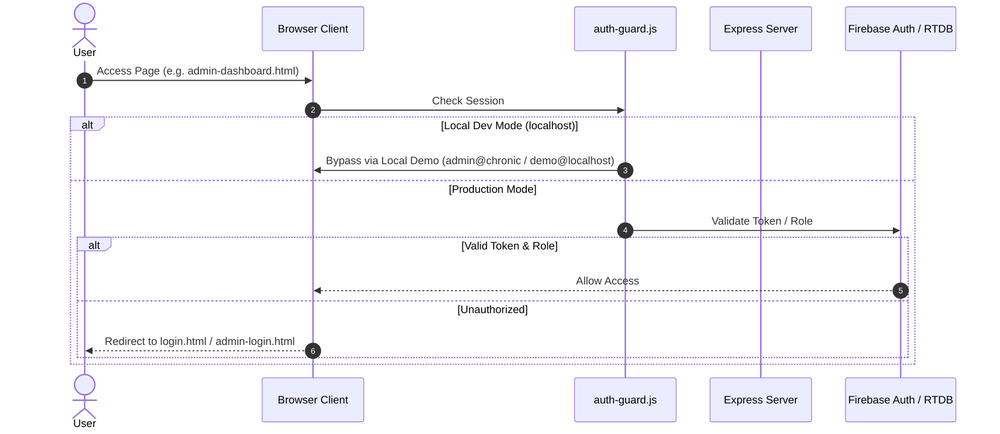

# ChronicAI — System Architecture, Data Flow & Design Patterns Guide

## Executive Summary

**ChronicAI** is an AI-powered civic complaint analysis, priority rating, and municipal authority routing system. Built for high availability, offline field worker synchronization, and multi-tier authentication, it bridges citizens and local government authorities.

---

## 1. System Architecture Overview

```mermaid
graph TD
    subgraph Client Layer (Frontend)
        CitizenApp["Citizen Portal (login.html, report-problem.html)"]
        AdminApp["Government Portal (admin-login.html, admin-dashboard.html)"]
        OfflineSync["Offline Sync Manager (field-offline-sync.js)"]
    end

    subgraph Cluster Layer (High Availability)
        Supervisor["Node Cluster Primary Supervisor (server/server.js)"]
        Worker1["Express Worker 1 (server/firebase.js)"]
        Worker2["Express Worker 2 (server/firebase.js)"]
    end

    subgraph Service & Domain Layer (Backend)
        Routes["API Routes (/api/incidents, /api/missions, /api/sync)"]
        AIService["AI Chronic Analysis (ai-validation.js - Gemini API)"]
        PriorityEngine["Priority Rating Engine (priority-engine.js)"]
        DupDetector["Duplicate Incident Detector (duplicate-detector.js)"]
        MissionService["Resource & Mission Dispatch (mission-service.js)"]
        OTPService["Secure OTP Engine (otp-service.js)"]
    end

    subgraph External & Database Services
        FirebaseDB["Firebase Realtime Database"]
        FirebaseAuth["Firebase Authentication"]
        EmailProviders["Email Delivery (Resend / Brevo / Nodemailer SMTP)"]
    end

    CitizenApp -->|HTTPS / REST| Routes
    AdminApp -->|HTTPS / REST| Routes
    OfflineSync -->|Queue / Sync| Routes

    Supervisor -->|Fork & Monitor Heartbeat| Worker1
    Supervisor -->|Fork & Monitor Heartbeat| Worker2

    Routes --> AIService
    Routes --> PriorityEngine
    Routes --> DupDetector
    Routes --> MissionService
    Routes --> OTPService

    OTPService --> EmailProviders
    AIService -->|Google GenAI API| Gemini
    Routes --> FirebaseDB
    Routes --> FirebaseAuth
```

---

## 2. End-to-End User & Data Flows

### A. Citizen Incident Reporting & AI Analysis Flow
1. **User Submission**: Citizen submits a report via `report-problem.html` with title, category, description, location, and images.
2. **Local Duplicate Check**: Backend (`duplicate-detector.js`) checks geospatial coordinates and text similarity against recent reports.
3. **AI Chronic Analysis**: `ai-validation.js` passes complaint content to `@google/genai` (Gemini API) to:
   - Extract core problem metrics & severity level.
   - Categorize emergency urgency and assign the responsible civic department.
   - Detect chronic pattern indicators (repeating civic issues).
4. **Priority Scoring**: `priority-engine.js` calculates a dynamic score based on AI severity, density of nearby reports, impact zone, and time elapsed.
5. **Database Persistence**: Incident is saved into Firebase Realtime Database (`/incidents/{id}`).

---

### B. Field Worker Offline Synchronization Flow
1. **Offline Capture**: Field workers log inspections or mission updates offline using `field-offline-sync.js`.
2. **Local Queueing**: Changes are appended to `localStorage` / `IndexedDB` with client timestamps and UUIDs.
3. **Re-connection Trigger**: Browser `online` event or manual sync triggers POST `/api/sync`.
4. **Conflict Resolution**: `sync-service.js` merges updates, checks server timestamps, and applies state mutations.

---

### C. Multi-Tier Authentication & Access Flow


---

## 3. Design Patterns Applied in ChronicAI

### 1. **Supervisor / Worker Pattern (Cluster HA)**
* **Location**: `server/server.js`
* **Purpose**: Runs a primary supervisor process that forks 2 worker processes running `server/firebase.js`. The supervisor monitors heartbeat telemetry and RSS memory usage (`HA_MAX_RSS_MB`), automatically terminating and re-forking unresponsive workers.

### 2. **Strategy Pattern (Multi-Channel Email / OTP Fallback)**
* **Location**: `server/email-service.js` & `server/otp-service.js`
* **Purpose**: Tries email providers sequentially: `Resend API` $\rightarrow$ `Brevo API` $\rightarrow$ `Nodemailer SMTP`. If one provider fails or is unconfigured, the strategy dynamically falls back to the next without breaking user flow.

### 3. **Circuit Breaker / Local Dev Fallback Pattern**
* **Location**: `public/js/login.js` & `public/js/admin-login.js`
* **Purpose**: Allows seamless local development offline or without Firebase configuration by detecting `localhost` hostnames and logging in via `demo@localhost` or `admin@chronic`.

### 4. **Layered Domain-Driven Design (DDD)**
* **Location**: `server/domain/` & `server/services/`
* **Purpose**: Separates pure business domain rules (`incident.js`, `operations.js`) from infrastructure routes and database access (`routes/`, `firebase.js`).

### 5. **Offline Queue & Eventual Consistency Pattern**
* **Location**: `public/js/field-offline-sync.js` & `server/services/sync-service.js`
* **Purpose**: Guarantees data durability in remote areas with unstable network connectivity.

---

## 4. Recommendations to Improve Codebase Architecture

To elevate this codebase to production-grade, state-of-the-art standards, implement the following improvements:

### 💡 Recommendation 1: Adopt TypeScript for End-to-End Type Safety
* **Current State**: JavaScript ES Modules with dynamic typing.
* **Improvement**: Migrate `.js` domain models and service interfaces to TypeScript (`.ts`). This prevents runtime errors in AI JSON parsing, priority scoring math, and sync payloads.

### 💡 Recommendation 2: Centralize Middleware for Auth & Authorization
* **Current State**: Auth logic duplicated across frontend JS files (`login.js`, `admin-login.js`) and inline backend checks.
* **Improvement**: Implement Express JWT authentication middleware (`verifyBearerToken`) on server routes and unify client auth guards into a single ESM utility module.

### 💡 Recommendation 3: Implement Event-Driven Architecture (Pub/Sub)
* **Current State**: In-request execution for AI validation, priority scoring, and mission allocation.
* **Improvement**: Decouple heavy operations using an event emitter or Redis queue (e.g. `BullMQ`):
  ```
  Incident Created -> Publish 'incident.created' event -> Worker runs AI Analysis asynchronously -> Priority updated -> Dispatch Notification
  ```

### 💡 Recommendation 4: Modular UI Component Library
* **Current State**: Monolithic JS files (`login.js` is over 4,000 lines).
* **Improvement**: Break large frontend scripts into lightweight ESM components or adopt a lightweight UI library (Vite + React / Web Components) to isolate UI render logic from network/data state.

---

## 5. Quick Reference Credentials (Local Development)

| Role | Portal Page | Email | Password |
| :--- | :--- | :--- | :--- |
| **Government Admin** | `/html/admin-login.html` | `admin@chronic` | `chronic` |
| **Citizen User** | `/html/login.html` | `demo@localhost` | `LocalDemo123!` |
