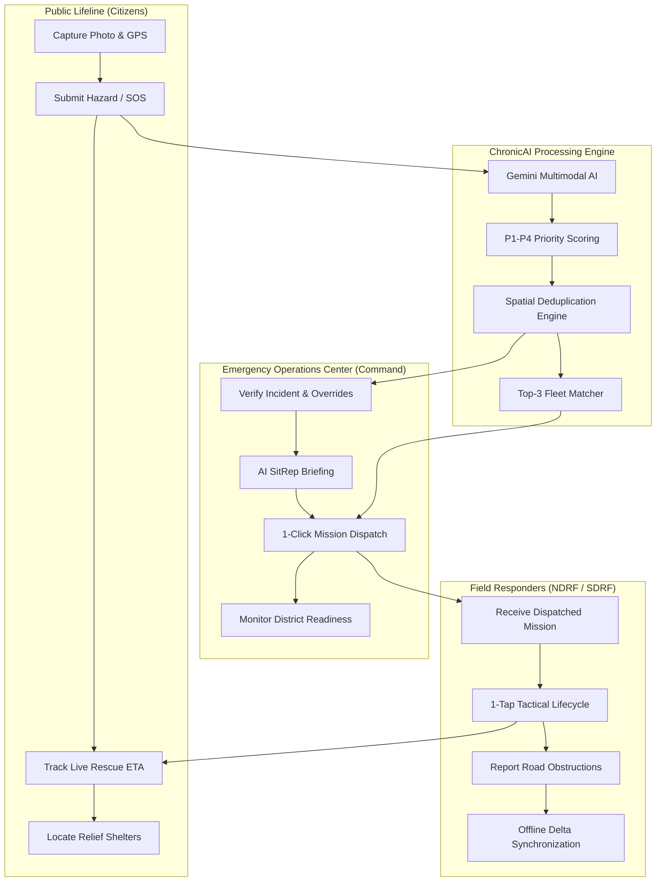
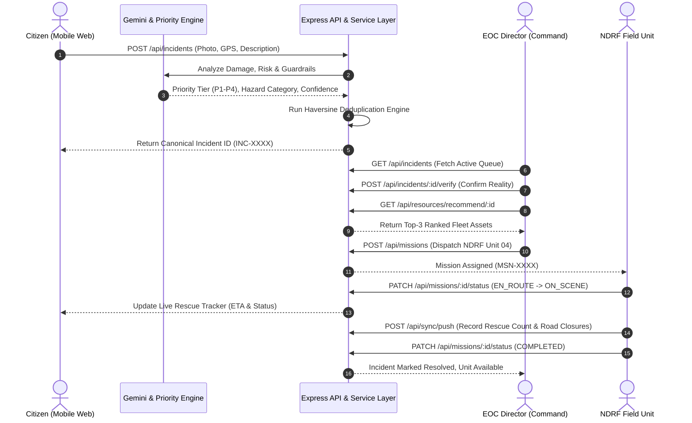
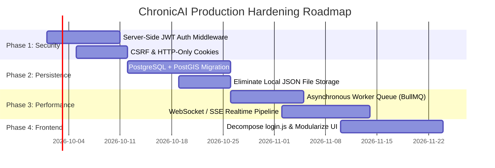

# ChronicAI — Complete System Functionality, Architecture & Critical Technical Audit

> **Document Version**: 2.4.0  
> **Classification**: Technical Architecture & Security Audit  
> **Target Audience**: Core Engineering Team, Solutions Architects, Government Stakeholders, SIH Evaluators

---

## Executive Summary

**ChronicAI** is an emergency management and civic crisis response platform engineered to bridge the gap between affected citizens, municipal emergency command directors, and on-ground disaster response units (e.g., NDRF, SDRF, fire/medical fleets).

During rapid-onset urban crises—such as severe flash floods, structural collapses, and washed-out arterial bridges—standard emergency communication channels (voice lines, municipal portals) experience severe saturation, resulting in uncoordinated dispatch, duplicate reporting, and life-threatening response delays. ChronicAI addresses these failure points through:
1. **Multimodal Incident Intake & AI Severity Scoring**: Citizen reports (photos, GPS coordinates, descriptions) are validated and prioritized via Google Gemini AI paired with deterministic heuristic fallback engines.
2. **Intelligent Spatial Deduplication**: Proximity clustering using Haversine distance calculations groups multiple citizen reports into single canonical incidents to eliminate command clutter.
3. **Algorithmic Fleet Allocation**: Automated multi-criteria scoring identifies and recommends the top-3 best-positioned rescue assets based on distance, equipment readiness, and operational specialty.
4. **Offline-First Resilient Telemetry**: Field units operate seamlessly in disconnected environments through local IndexedDB queues, synchronizing via two-way delta sync operations upon network recovery.

---

## 1. Stakeholder Architecture & Core User Personas

The platform coordinates four distinct stakeholder classes across isolated operational portals:



### Stakeholder Specification Matrix

| Role | Primary Portal | Access Scope & Responsibilities | Core Workflows |
|:---|:---|:---|:---|
| **1. Citizen** | `citizen-dashboard.html` | Public relief, personal hazard reporting, distress calls, resource finding | • Submits incident with photo & geolocation (`report-problem.html`)<br>• Triggers 1-tap SOS distress beacon<br>• Tracks assigned rescue vehicle arrival in real time<br>• Searches relief shelters & missing persons database |
| **2. Emergency Officer** | `admin-dashboard.html` | High-level municipal oversight, incident validation, fleet dispatch, drill simulations | • Reviews incoming AI-assessed incidents & SitRep briefings<br>• Executes 1-click verification & priority tier overrides<br>• Reviews algorithmically scored top-3 fleet matches & dispatches missions<br>• Seeds Ward 7 flood simulation drills for testing |
| **3. Field Responder** | `responder-dashboard.html` | Tactical execution, en-route telemetry, field hazard logging, victim extrication | • Receives dispatch orders with target coordinates<br>• Advances mission states: `EN_ROUTE` $\rightarrow$ `ON_SCENE` $\rightarrow$ `EXTRICATING` $\rightarrow$ `COMPLETED`<br>• Logs flooded streets & debris obstructions<br>• Operates offline with automated background synchronization |
| **4. Donors & Volunteers** | `support.html`, `resource-center.html` | Civil society coordination, relief supply routing, missing person search | • Contributes relief kits and supplies<br>• Queries active missing person bulletin boards<br>• Accesses official safety protocols and advisories |

---

## 2. End-to-End System Workflow



---

## 3. Detailed Application Page & Controller Mapping

| Page File | Route / URL | Controller Script(s) | Primary Purpose & APIs Consumed |
|:---|:---|:---|:---|
| **`index.html`** | `/`, `/index.html` | `theme-manager.js`, `offline-app.js`, inline hero logic | High-impact civic landing page, feature showcase, dynamic day/night mode, system status. |
| **`login.html`** | `/login.html` | `login.js`, `auth-guard.js`, `offline-app.js` | Unified authentication portal for Citizen, Officer, and Field Responders with role-aware destination routing. |
| **`citizen-dashboard.html`** | `/citizen-dashboard.html` | `citizen-dashboard.js`, `auth-guard.js`, `location-manager.js` | Citizen operations hub: active incidents, live rescue vehicle tracker, shelter directory, SOS panic button. |
| **`admin-dashboard.html`** | `/admin-dashboard.html` | `admin-dashboard.js`, `auth-guard.js`, `theme-manager.js` | EOC Command Center: AI SitRep briefing, incident verification, Top-3 fleet dispatching, Ward 7 drill simulation. |
| **`responder-dashboard.html`** | `/responder-dashboard.html` | `responder-dashboard.js`, `auth-guard.js`, `field-offline-sync.js` | NDRF field console: active mission progression, road closure logging, offline status indicators, sync triggers. |
| **`report-problem.html`** | `/report-problem.html` | `report-problem.js`, `location-manager.js` | Incident creation form: live camera capture, automatic GPS acquisition, real-time AI severity preview. |
| **`admin-login.html`** | `/admin-login.html` | `admin-login.js`, `theme-manager.js` | Dedicated government authority sign-in with cryptographic validation and local development fallback. |
| **`missing-persons.html`** | `/missing-persons.html` | `missing-persons.js` | Public bulletin board to search, identify, and report displaced disaster victims. |
| **`resource-center.html`** | `/resource-center.html` | `resource-center.js` | Municipal relief shelter locator with real-time capacity and bed availability. |
| **`support.html`** | `/support.html` | Static / inline | Civic donation and humanitarian aid coordination interface. |

---

## 4. Technical Architecture & Component Deep Dive

### 4.1. High-Availability Server Architecture (`server/server.js`)
- Runs a primary process supervising $N$ worker processes using Node.js `cluster` with Round-Robin scheduling (`cluster.SCHED_RR`).
- Workers emit heartbeats every 2,000ms. If a worker fails to respond within 7,000ms or exceeds 768MB RSS memory, the supervisor terminates and re-forks the worker automatically.

### 4.2. Dual AI Validation & Fallback Layer (`server/services/ai-validation.js`)
- Primary analysis queries **Google Gemini 1.5** (`@google/genai`) to extract structured damage assessments, hazard categorizations, and life-safety indicators.
- In offline scenarios, API exhaustion, or rate-limit events (`429 Too Many Requests`), the engine automatically falls back to a deterministic heuristic keyword and regex rule processor. This guarantees that incident triage never halts during cloud service outages.

### 4.3. Priority Tier Calculation Engine (`server/domain/incident.js`, `server/services/priority-engine.js`)
Incidents are scored into four deterministic tiers based on multi-factor telemetry:
- **P1 (Critical)**: Immediate life hazard (drowning, collapsed structures, severe trapped casualties).
- **P2 (Major)**: Significant infrastructure failure or rising water levels endangering residential zones.
- **P3 (Moderate)**: Localized civic disruptions (blocked secondary storm drains, road washouts without immediate casualty risk).
- **P4 (Minor)**: Non-urgent structural defects, post-event debris, or minor maintenance requests.

### 4.4. Spatial Deduplication Engine (`server/services/duplicate-detector.js`)
- Compares incoming incident coordinates against active canonical incidents within a 500-meter threshold using the Haversine spherical distance formula:
$$d = 2R \cdot \arcsin\left(\sqrt{\sin^2\left(\frac{\Delta \phi}{2}\right) + \cos(\phi_1)\cos(\phi_2)\sin^2\left(\frac{\Delta \lambda}{2}\right)}\right)$$
- Merges secondary citizen reports non-destructively into the canonical incident, aggregating casualty estimates and appending source reports to an audit event log without losing evidence.

### 4.5. Fleet Scoring & Allocation Engine (`server/services/allocation-service.js`)
Evaluates registered resources (NDRF boats, ambulances, engineering units) against incident requirements:
$$\text{Score} = (\text{Capability Match} \times 0.45) + (\text{Proximity Score} \times 0.35) + (\text{Readiness State} \times 0.20)$$
Returns the Top-3 highest-scoring vehicles to command officers with estimated transit times.

---

## 5. Comprehensive Critical Technical Audit: Identified Problems & Vulnerabilities

While ChronicAI provides rich emergency response workflows and comprehensive testing coverage (31 passing tests), a rigorous architectural analysis reveals **critical production bottlenecks, security vulnerabilities, and reliability risks** that must be resolved prior to real-world municipal deployment.

---

### ✅ Critical Problem 1: Client-Side Authorization "Security Theater" [RESOLVED]
* **Severity**: **CRITICAL (P0)** — **STATUS: RESOLVED (Commit `9becb11`)**
* **Affected Files**: [`server/middleware/auth-middleware.js`](file:///d:/My%20Project/Chronic-/server/middleware/auth-middleware.js), [`public/js/auth-guard.js`](file:///d:/My%20Project/Chronic-/public/js/auth-guard.js), [`public/js/login.js`](file:///d:/My%20Project/Chronic-/public/js/login.js), [`server/routes/incidents.js`](file:///d:/My%20Project/Chronic-/server/routes/incidents.js), [`server/routes/missions.js`](file:///d:/My%20Project/Chronic-/server/routes/missions.js), [`server/firebase.js`](file:///d:/My%20Project/Chronic-/server/firebase.js)
* **Technical Resolution Implemented**:
  - Implemented server-side cryptographic HMAC-SHA256 session token generation and verification (`signSessionToken`, `verifySessionToken`).
  - Added centralized Express authentication middleware (`authenticateUser`) on all `/api/*` routes.
  - Enforced strict server-side RBAC with `requireRole(["admin", "government_officer"])` on `/api/incidents/:id/verify`, `/reject`, `/merge`, `/api/missions`, and `/api/dashboard/seed-ward7`.
  - Enforced `requireRole(["responder", "field_worker", "admin"])` on `/api/missions/:id/status`.
  - Added active cryptographic server handshake (`GET /api/auth/me`) in `auth-guard.js`. Any client attempting to spoof `localStorage.setItem("chronicAIRole", "admin")` without a valid server token is immediately caught, cleared, and kicked out.
  - Added automated security test suite ([`test/security-rbac.test.js`](file:///d:/My%20Project/Chronic-/test/security-rbac.test.js)) with 7 tests verifying 401 and 403 blocks. Total tests passing: 38/38.

---

### ✅ Critical Problem 2: Ephemeral Local Storage on Serverless (Vercel Data Loss) [RESOLVED]
* **Severity**: **CRITICAL (P0)** — **STATUS: RESOLVED**
* **Affected Files**: [`server/storage/storage-adapter.js`](file:///d:/My%20Project/Chronic-/server/storage/storage-adapter.js), [`server/services/incident-service.js`](file:///d:/My%20Project/Chronic-/server/services/incident-service.js), [`server/services/mission-service.js`](file:///d:/My%20Project/Chronic-/server/services/mission-service.js), [`server/services/sync-service.js`](file:///d:/My%20Project/Chronic-/server/services/sync-service.js), [`server/firebase.js`](file:///d:/My%20Project/Chronic-/server/firebase.js), [`server/seed/ward7-scenario.js`](file:///d:/My%20Project/Chronic-/server/seed/ward7-scenario.js)
* **Technical Resolution Implemented**:
  - Engineered centralized 3-tier resilient storage engine (`server/storage/storage-adapter.js`):
    1. **Primary Cloud Persistence**: Firebase Realtime Database with dual interface (Firebase Admin SDK when credentials are configured, plus non-blocking REST API client for cloud serverless environments).
    2. **Safe Serverless Local Storage**: Wrapped all synchronous file operations (`safeMkdirSync`, `safeWriteJson`, `safeReadJson`). On Vercel / AWS Lambda (`VERCEL=1`, `AWS_LAMBDA_FUNCTION_NAME`) or upon encountering `EROFS` / `EACCES` / `EPERM` read-only errors, writes are transparently redirected to `os.tmpdir()/chronicai-data` without throwing unhandled exceptions.
    3. **Write-Through In-Memory Cache**: Active mutations are immediately indexed in an in-memory cache, ensuring instant availability during container lifecycle and offline test execution.
  - Eliminated cold-start `EROFS` startup crash in `server/firebase.js` by replacing top-level synchronous `fs.mkdirSync` and `fs.writeFileSync(REPORTS_FILE)` with `safeMkdirSync`.
  - Built resilient Firebase credential parser supporting raw file paths (with `fs.existsSync` guard against `ENOENT`), direct JSON strings, and Base64-encoded strings with automatic `\n` normalization in `private_key`.
  - Added dedicated serverless storage test suite ([`test/storage-serverless.test.js`](file:///d:/My%20Project/Chronic-/test/storage-serverless.test.js)) verifying read-only disk simulation, `/tmp` failover, read fallback cascade, and credential parsing. Total tests passing: 42/42.

---

### 🟠 High Severity Problem 3: Cluster Race Conditions on File Persistence
* **Severity**: **HIGH (P1)**
* **Affected Files**: [`server/server.js`](file:///d:/My%20Project/Chronic-/server/server.js), [`server/services/incident-service.js`](file:///d:/My%20Project/Chronic-/server/services/incident-service.js)
* **Technical Defect**:
  - In cluster mode (`server/server.js`), two independent Node.js worker processes run simultaneously.
  - When worker 1 and worker 2 receive simultaneous incident submissions, both perform:
    ```javascript
    const incidents = readIncidentsLocal(); // Read entire array into memory
    incidents.push(newIncident);            // Modify in-memory array
    fs.writeFileSync(tempPath, JSON.stringify(incidents)); // Write temp file
    fs.renameSync(tempPath, INCIDENTS_FILE); // Overwrite master file
    ```
  - Without inter-process file locking (e.g. `proper-lockfile`), worker 2 will overwrite worker 1's write, causing silent data loss of disaster reports under concurrent municipal load.

---

### 🟠 High Severity Problem 4: Monolithic Codebase & Maintainability Debt
* **Severity**: **HIGH (P1)**
* **Affected Files**: [`public/js/login.js`](file:///d:/My%20Project/Chronic-/public/js/login.js) (4,283 lines), [`server/firebase.js`](file:///d:/My%20Project/Chronic-/server/firebase.js) (3,418 lines)
* **Technical Defect**:
  - `login.js` has grown into a massive 4,283-line monolith containing embedded CSS styling rules, SVG icon templates, registration forms, map utilities, modal dialogs, and authentication listeners.
  - `server/firebase.js` is 3,418 lines long, combining Express bootstrapping, legacy database wrappers, Gemini API handlers, SLA escalation interval loops, email provider strategies, and dozens of un-routed endpoints.
  - This extreme code density makes debugging difficult, increases bundle parse time on low-end mobile devices in disaster zones, and risks regression bugs on every edit.

---

### 🟡 Medium Severity Problem 5: Synchronous In-Request AI Latency
* **Severity**: **MEDIUM (P2)**
* **Affected Files**: [`server/routes/incidents.js`](file:///d:/My%20Project/Chronic-/server/routes/incidents.js), [`server/services/ai-validation.js`](file:///d:/My%20Project/Chronic-/server/services/ai-validation.js)
* **Technical Defect**:
  - When a citizen posts an incident via `POST /api/incidents`, the backend awaits Google Gemini's multimodal response synchronously before returning an HTTP response to the client.
  - Under cellular congestion or slow Gemini API response times (typically 2.5s to 6.0s), the citizen's mobile client hangs, leading to multiple retry submissions and perceived application failure during an emergency.

---

### 🟡 Medium Severity Problem 6: Polling Telemetry vs. Real-Time WebSockets
* **Severity**: **MEDIUM (P2)**
* **Affected Files**: [`public/js/admin-dashboard.js`](file:///d:/My%20Project/Chronic-/public/js/admin-dashboard.js), [`public/js/citizen-dashboard.js`](file:///d:/My%20Project/Chronic-/public/js/citizen-dashboard.js)
* **Technical Defect**:
  - Neither dashboard utilizes **WebSockets** or **Server-Sent Events (SSE)**.
  - The client dashboards fetch updates by periodically polling endpoints (`setInterval`) or relying on manual page refreshes.
  - When an EOC officer dispatches NDRF Unit 04, the citizen's tracking screen does not update instantaneously; it only updates on the next poll cycle, delaying critical emergency updates.

---

### 🟡 Medium Severity Problem 7: Naive Last-Write-Wins (LWW) Offline Conflict Resolution
* **Severity**: **MEDIUM (P2)**
* **Affected Files**: [`server/services/sync-service.js`](file:///d:/My%20Project/Chronic-/server/services/sync-service.js), [`public/js/field-offline-sync.js`](file:///d:/My%20Project/Chronic-/public/js/field-offline-sync.js)
* **Technical Defect**:
  - The offline sync protocol applies incoming updates sequentially using client-provided timestamps.
  - If two disconnected rescue teams report conflicting road closures or different casualty figures for the same incident while offline, the system overwrites the earlier sync payload with the later one without flagging a field discrepancy for commander review.

---

### 🟡 Medium Severity Problem 8: $O(N)$ Unindexed Geospatial Deduplication
* **Severity**: **MEDIUM (P2)**
* **Affected Files**: [`server/services/duplicate-detector.js`](file:///d:/My%20Project/Chronic-/server/services/duplicate-detector.js)
* **Technical Defect**:
  - For every new incident submission, the system iterates over all active incidents in memory and computes the Haversine trigonometric formula against each one.
  - While fast for 50 incidents during a demo, during a real city flood with 10,000+ reports, performing $O(N)$ trigonometric calculations on every single submission will cause CPU spikes and event-loop lag.

---

## 6. Actionable Engineering Remediation Roadmap

To transition ChronicAI from an evaluation prototype to a mission-critical, enterprise-grade municipal platform, the following phased upgrades should be executed:



### 1. Phase 1: Zero-Trust Backend Security (Target: Immediate)
- Implement Express middleware (`authenticateUser`, `requireRole(["admin"])`) on all `/api/*` mutation endpoints.
- Store session tokens in `HttpOnly`, `Secure`, `SameSite=Strict` cookies rather than readable `localStorage`.

### 2. Phase 2: Production Relational Database with Spatial Indexing (Target: Sprint 2)
- Replace `data/*.json` and Firebase RTDB tree dumps with a managed database (PostgreSQL + PostGIS or Supabase).
- Leverage PostGIS spatial queries (`ST_DWithin`) for incident deduplication:
  ```sql
  SELECT * FROM incidents 
  WHERE ST_DWithin(geom, ST_MakePoint($lon, $lat)::geography, 500);
  ```
  This reduces lookup complexity from $O(N)$ to $O(\log N)$ using R-Tree spatial indexing.

### 3. Phase 3: Asynchronous Event Bus for AI Processing (Target: Sprint 3)
- Decouple AI analysis from HTTP intake using Redis and BullMQ:
  ```text
  Citizen Submits Report -> Stored as "PENDING_AI" (HTTP 202 Accepted in 80ms)
       |
       v
  Worker Queue picks up job -> Runs Gemini Analysis -> Updates Priority -> Emits WebSocket Event
  ```

### 4. Phase 4: Bi-Directional Real-Time Communication (Target: Sprint 4)
- Integrate a WebSocket layer (or Server-Sent Events) to push live vehicle coordinates, mission dispatches, and verification alerts instantly to all connected dashboards without polling.

### 5. Phase 5: Modular Frontend Refactoring (Target: Sprint 5)
- Decompose `login.js` into focused, single-responsibility modules:
  - `auth-service.js` (network calls & session tokens)
  - `role-navigator.js` (clean routing)
  - `stakeholder-ui.js` (DOM interaction)
- Adopt a standard build step (Vite) to eliminate duplicate CSS and script payload overhead.

---

## 7. Current Evaluation Credentials (Reference)

| Role | Evaluation Email | Accepted Password | Authorized Dashboard |
|:---|:---|:---|:---|
| **Citizen (Public Lifeline)** | `citizen@chronic.gov` | `LocalDemo123!` or `LocalDemo123` | [`citizen-dashboard.html`](file:///d:/My%20Project/Chronic-/public/html/citizen-dashboard.html) |
| **Emergency Officer (EOC Command)** | `officer@chronic.gov` | `LocalDemo123!` or `LocalDemo123` | [`admin-dashboard.html`](file:///d:/My%20Project/Chronic-/public/html/admin-dashboard.html) |
| **Field Responder (NDRF Unit 04)** | `responder@chronic.gov` | `LocalDemo123` or `LocalDemo123!` | [`responder-dashboard.html`](file:///d:/My%20Project/Chronic-/public/html/responder-dashboard.html) |

---
*Document maintained by ChronicAI Core Engineering. Generated for system audit, architecture review, and hackathon presentation.*
